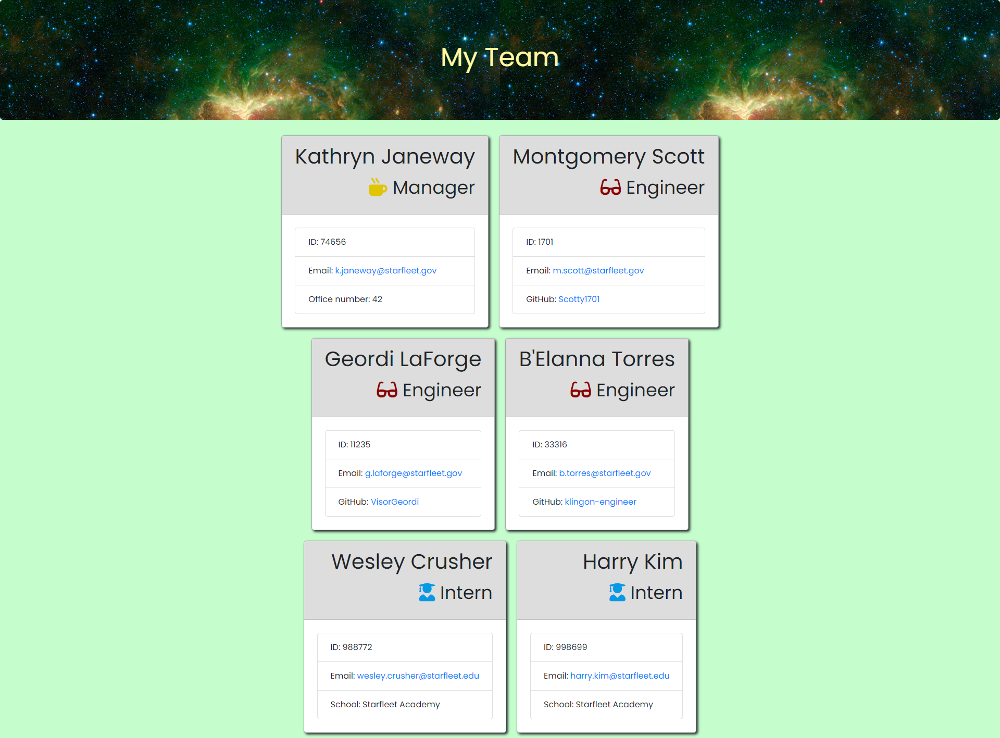

# Team Profile Generator

## Table of Contents

* [Description](#description)
* [Screenshots](#screenshots)
* [Installation](#installation)
* [Usage](#usage)
* [Technologies Used](#technologies)
* [Tests](#tests)
* [Credits](#credits)
* [Contributing](#contributing)
* [Questions](#questions)
* [License](#license)

## Description

This is a CLI application using Node.js that generates an html file containing names, roles, IDs, email addresses, an office number (for managers), GitHub account link (for engineers), and school (for interns.) The user should begin by creating an 'output' folder in the folder containing the application, then opening said containing folder in the terminal. Once in the containing folder in the terminal, the user, who is assumed to be the manager or team leader, begins by entering "node app.js". They are then taken through a series of prompts eliciting relevant information about their team members. To indicate that they have entered all of the team members, the user selects "None" to answer the question, "What type of team member would you like to add?" The application then synthesizes the information into an html file the user can access from the "output" folder inside their project folder.

[Link to walkthrough video](https://drive.google.com/file/d/14Y77zksXcUSfyXXI9gjCWBtUWVf3rcxJ/view)

## Screenshots

Generated team roster page, viewed through the browser:

  
## Installation Instructions

If you want to run a copy of this app on your local machine, first clone the repository:

HTTPS:
```
$ git clone https://github.com/LauraCole1900/teamProfileGenerator.git
```

SSH:
```
$ git clone git@github.com:LauraCole1900/teamProfileGenerator.git
```

Then cd/ into the cloned directory and download the dependencies into the cloned directory by entering into the command line:
```
$ npm install --save
```

Once the dependencies are installed, start the application by typing into the command line:
```
$ node app.js
```

## Usage

This project is intended to be used to generate a roster-page for a team of developers that includes a manager, any number of engineers, and any number of interns.

## Technologies Used

Node.js, Inquirer, Jest

## Tests

npm run test

## Credits

Front-end code developed and provided by 2U/Trilogy Education Services

## Contributing

We believe code is never finished, welcome your contributions to enhance the applications functionality. Please adhere to the Code of Conduct for the Contributor Covenant, version 2.0, at https://www.contributor-covenant.org/version/2/0/code_of_conduct.html.

## Questions

If you have further questions, you can reach me at lauracole1900@comcast.net. For more of my work, see [my GitHub](https://github.com/LauraCole1900).

## License

.
